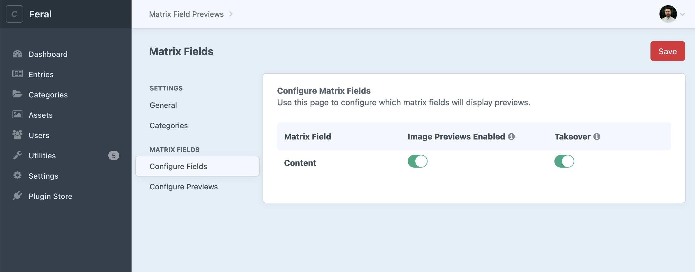
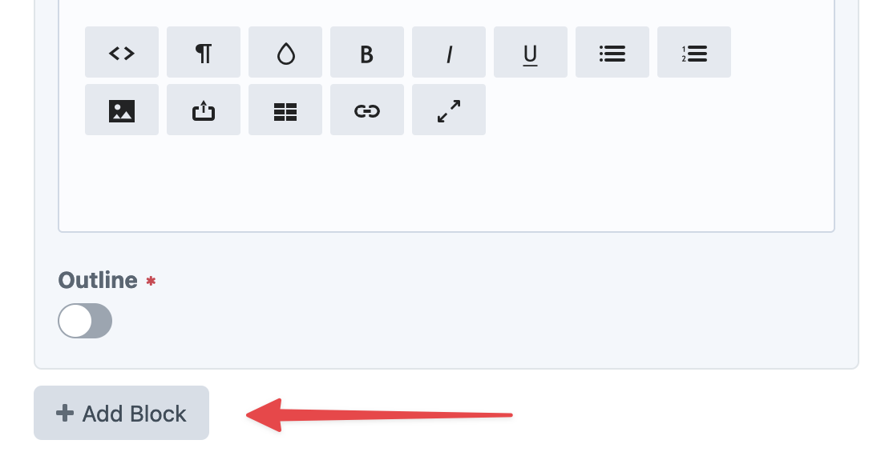
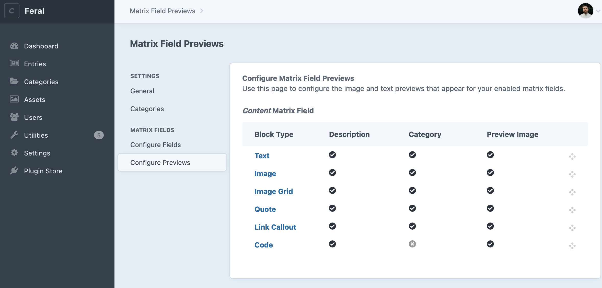

# Matrix Field Preview

Configure a screenshot preview for all your matrix field blocks, giving your clients a better publishing experience.

## Overview

For content-heavy websites, it sometimes makes sense to create a ["content builder"](https://nystudio107.com/blog/creating-a-content-builder-in-craft-cms) in Craft by using matrix fields to define a number of blocks that your client can use to publish content. This is really powerful but also leads to a confusing publishing experience. 

On big sites, you might have 10s of different blocks in a particular matrix field:

When your client goes to publish they'll see a huge dropdown:

There are a number of existing plugins like [Spoon](https://plugins.craftcms.com/spoon) and [Matrix Mate](https://plugins.craftcms.com/matrixmate) that help deal with this but as the number of matrix field blocks grows, even with descriptive block titles it can be tricky to figure out what a block will look like. 

Craft Matrix Field Preview solves this by allowing you to upload screenshots of the rendered blocks so that your client can see at-a-glance what the content they are about to publish will look like. 

When they publish new content, instead of using the native dropdown shown above, they'll get an overlay modal with examples:

As well as a preview on existing blocks.

## Requirements

This plugin requires Craft CMS 3.0.0 or later.

## Installation

To install the plugin, follow these instructions.

1. Open your terminal and go to your Craft project:

        cd /path/to/project

2. Then tell Composer to load the plugin:

        composer require weareferal/matrix-field-preview

3. In the Control Panel, go to Settings → Plugins and click the “Install” button for Matrix Field Preview.

## Configuration

Configuration is handled in the plugin settings page. There are three tabs:

- General settings
- Matrix field settings
- Matrix block type settings

The first step is to select a volume to hold your preview screenshots (you must already have a volume configured). 

Once saved, next configure which of your matrix fields you want to enable previews for:

You can also choose to optionally "takeover" the default matrix field experience. This means only the new preview overlay modal can be used to select matrix fields block.

Alternatively, if you choose not to "takeover", the existing matrix field block button will continue to be displayed, while a "preview" button will be included alongside, giving users the best of both worlds.

Finally, configure the actual previews and descriptions for your matrix block types. 

Click into each block type to configure them individually (the more the merrier).

## Usage

Once configured, you (and your client) will now see your previews live when they are editing content. If you go into your entries and click the "add block" of your matrix field, you will see a modal popup with all the blocks for that field alongside your descriptions and screenshots. 

You will also get an inline preview for all existing blocks. This inline preview has a hover-over effect that will give the client a larger preview of what the block looks like.

## Caveats

- Configuration of preview fields happens in a custom database table. When you go to migrate your site to staging or production your configuration will not be added be default. You will need to either perform a database dump/restore to ensure the configuration gets transferred, or use another tool to sync your database (like [`craft-remote-sync`](https://github.com/weareferal/craft-remote-sync) for example 😉)

## Todo

- Improve configuration approach when migrating (see above caveat and [Issue #18](https://github.com/weareferal/craft-matrix-field-preview/issues/18))

## Support

Brought to you by [Feral](https://weareferal.com). If you have any problems please leave an issue on Github or find us on the Craft Discord (username `timmy`).

